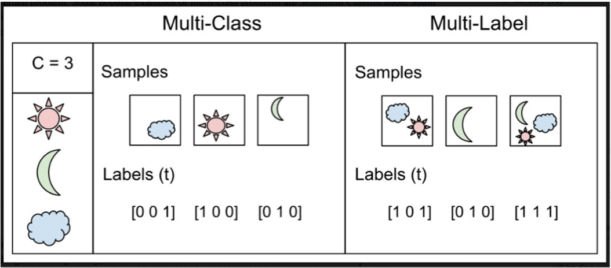
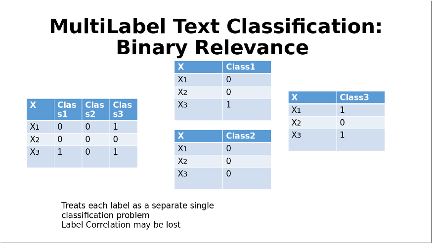
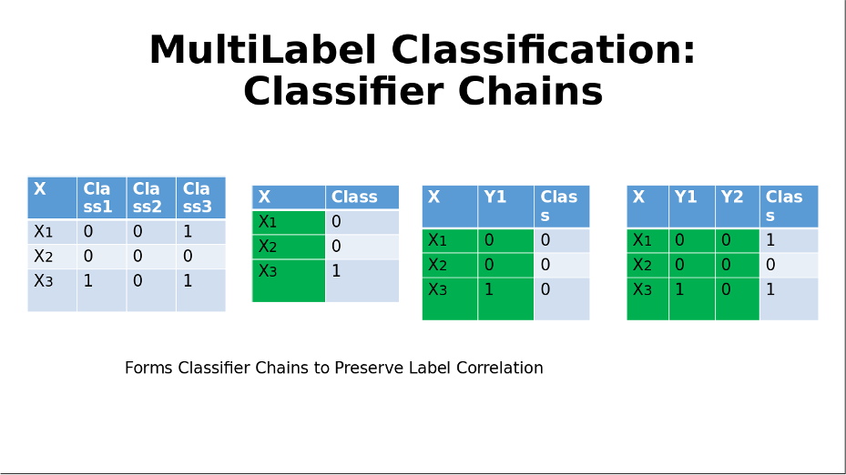
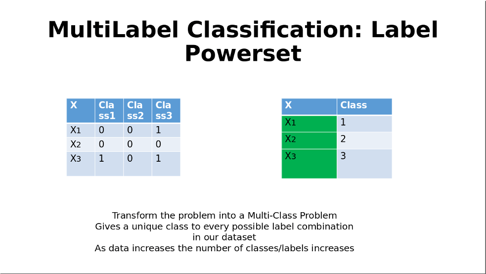

# **Product Categorization on E-Commerce Products**

Creating relevant tags and categories on products allow e-commerce companies (such as Amazon, Wayfair, eBay in the US, Mercado Libre, Dafiti in Latam, or ASOS.com and Zalando in Europe), and super apps and marketplaces (such as Instacart in the US, Rappi, Frubana, JOKR in Latam) to automatically categorize products whether those are new products uploaded by a user or seller products that need large-scale automated categorization.

Automation on this subject not only saves time and manual effort but creates a taxonomy system that improves the process of a customer finding what they are looking for, improving their conversion metrics, and activating frictionless and engaging shopping experiences. In this project we will apply natural language processing to create a multi-label system able to classify e-commerce products automatically.


## **Motivation**

My motivation to start doing this project was to get more knowledge about processes of an NLP project. I have already done Binary and Multi-Class Classification Projects, so I wanted to try something harder, a Multi-Label Classification problem.

Also, nowadays there are millions of e-commerce which could make use of such a powerful automation tool as this one. So, the idea of automatically categoryzing products it is an amazing real world application of AI. 

Let´s talk a little bit about the project. I wanted to try the most recommended library por this kind of problems, **scikit-multilearn** which basically as its name indicate, is built on top of our good friend sklearn but with the particullarity of being specifically design for Multi-Label Classification problems. It counts with powerful algorithms design for this kind of problems.

I am briefly going to introduce the 3 used on the Model Evaluation Notebook, so the reader can gain more clarity on what is happening under the hood.

## **Multi-Label Classification Introduction**

Firstly, just to be sure we are all on the same page. A little intro into what is a Multi-Label Classification. As its name indicates it, a sample will have the possibility of not only being classify with one label but now with 2 or more. I believe it´s important highlighting the difference within Multi-Class Classification because it may seem as the same thing... Let´s put all this together on an example.

To make it easy and follow the concept, we can use the projects I have done and share which probably you have already seen them by now.

**Binary Classification**: The HomeCreditLoan project, we were trying to see if a Bank could predict wether a client would be able to return a loan or not. Two possible outcomes, yes or no.

**Multi-Class Classification**: The SentimentAnalysis project from Spotify reviews. We were trying to predict wheter the user´s feedback about the app was "Positive", "Neutral" or "Negative". Three possible outcomes (it could have been more, the idea is that it should be more than two)

**Multi-Label Classification**: This current project. We will be trying to see if a product belongs to one or more classes. This could not happen on the other projects, the probability of a client to return a loan would be either yes or no, or the Sentiment of a review would either be "Positve", "Neutral" or "Negative". Now, a product, let´s put an Iphone11 cover as an example, could be classify as "Technology", "CellPhones", "Iphones" and "Iphones Items". All of this labels are correct. There is clearly an importance of hierarchy...



Well, having said this, let´s explain the used algorithms on the project.

### **Binary Relevance**

This technique treats each label independently, and the multi-labels are then separeted as single class classification.



### **Classifier Chains**

In this technique, we have multiple classifiers connected in a chain. The first classifier is built using the input data. The following classifiers are trained using the combined inputs and the previous classifiers in a given chain


### **Label Powerset**

The goal is to find a combination of unique labels and asssign them different values.




## **Project Structure**
  
On this project, we will code and deploy an API for serving our own machine learning model. For this particular case, it will be for Sentimnt Analysis Classification for the Spotfy App.


```
├── api
│   ├── main.py
│   ├── database.py
│   ├── models.py
│   ├── schemas.py
│   ├── config.py
│   └── utils.py
│       
├── test
│   ├── database.py
│   ├── conftest.py
│   └── test_product.py
│
├── Notebooks
│   ├── EDA.ipynb
│   ├── ModelEvaluation.ipynb
│   ├── nn_aux.py
│   ├── evaluation.py
│   └── text_normalizer.py
│
├── Dockerfile
├── docker-compose.yml
├── requirements.txt
├── README.md
└── REPORT.md

```

Let's take a quick overview on each module:

- api: It has all the needed code to implement the communication interface between the users and our service. It uses fastapi and PostgreSQL to save user´s feedback and rating.
    - `api/main.py`: Setup and launch our api.
    - `api/database.py`: PostgeSQL Database Initialization.
    - `api/models.py`: Database Tables Declaration with SQLAlchemy.
    - `api/schemas.py`: Database Tables Validation Schemas.
    - `api/utils.py`: Implements some extra functions used internally by our api.
    - `api/config.py`: It has all the API settings.
  
- test: Contains all the files to perform the testing of the app.
    - `database.py`: PostgeSQL Test Database Initialization.
    - `conftest.py`: Holds the global functions (@fixture) of the routes test.
    - `test_products.py`: *create_products* tests.
  
- Notebooks: Contains all the notebooks and files to perform the Model cleaing, training and evaluation.
    - `EDA.ipynb`: EDA is performed here.
    - `ModelEvluation.ipynb`: Model Evluation is performed here.
    - `nn_aux.py`: Holds the Auxiliary functions of the Neural Network visualization and evaluation.
    - `evaluation.py`: Holds the Evaluation functions.
    - `text_normalizer.py`: Holds the Text Normalization functions.


## Installation

You can pull the image from DockerHub, to do so you must have an account. If you don´t, you can clone my project into your local repo and run this command:

      docker-compose -f docker-compose.yml up -d

By doing this you will be building the image and start running your container on the same step, it isn´t mandatory to do it in this way as there are others, it´s just a recommendation. On the Dockerfile, you can see the use of two services (the app itself and the database) which logically are started by different images. The App image is declare and "build" it on the Dockerfile and the Postgresql is the official one from DockerHub. 

Be aware that if you change the places from files of folders or anything like that you may be probably harming the full functionallity of the API for different reasons. And also that you should declare your own environment variables for initializing your database on a ".env" file

Once the Container is running you can go to your **localhost/docs** url and try for yourself all the routes.

OBS: You would need to train and save your own model and its tokenizer to do so, my final one weights over 100MB and it can not be uploaded.


